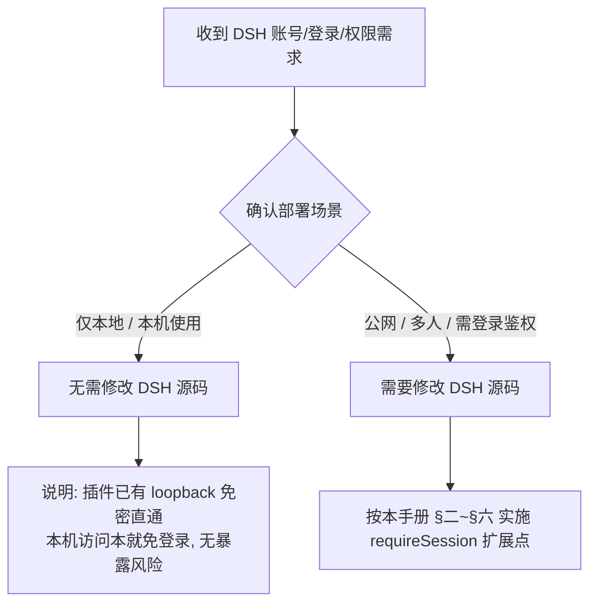

# 给 AI 的决策指导：DSH 公网账号系统（源码级扩展点）

> 本文是给 **AI（代码智能体）** 的决策与修改指导，用于处理用户提出「DSH 账号 / 登录 / 多用户 / 权限」相关需求时，**先正确判断部署场景**，再决定是否需要修改 DSH 源码。
>
> 关联插件：`dsh-postapi-bridge`（登录 / 多账号 / 管理面板）。

---

## 一、AI 决策流程：先判断部署场景（重要）

收到「账号 / 登录 / 多用户 / 权限管理」需求时，**先判断用户的使用场景，不要默认动手改源码**：



### 1.1 仅本地使用（loopback）→ 不改源码
- **结论**：**不需要修改 DSH 源码**。
- **原因**：`dsh-postapi-bridge` 对 loopback 访问本就**免密直通**；本机 `127.0.0.1` 访问无登录门槛，也不存在公网暴露风险。
- **AI 应做**：直接向用户说明「仅本地使用无需账号系统，本机访问即可；若日后需对外多人访问，再启用公网鉴权」，然后停止后续源码改动。

### 1.2 公网 / 多用户使用 → 需改源码
- **结论**：**必须修改 DSH 源码**（仅靠插件不够）。
- **原因**：见 §二。官方 `/api/*` 对公网 `trusted-host` 访问者不做登录校验，未登录即可调用核心功能（含命令执行）。
- **AI 应做**：先向用户确认是否接受「修改官方源码 + fork 维护」的成本（见 §五 git 维护），再按 §三 实施。

> **决策铁律**：用户明确「仅本地」→ **绝不改源码**；用户明确「公网 / 需要登录」→ 才实施扩展点。拿不准时，**先问清部署场景再动手**。

---

## 二、背景：为什么公网必须改 DSH 源码

DSH 官方把 `/api/*` 的信任边界**定义在"谁能连到这个服务"（Host 头），而非"是否登录"**。这是单用户桌面工具的默认设计，且官方 webserver 从架构上**没有给"登录校验"留任何纯插件接入位**：

| 官方架构约束 | 对插件的影响 |
| :--- | :--- |
| **无 HTTP 中间件 / 守卫钩子** | 不存在"在路由前统一鉴权"的扩展点 |
| **路由注册防重复**（同 `kind + path` 抛错） | `/api` 前缀已被 `client-connection` 占用，插件无法覆盖 |
| **前缀匹配需 `startsWith(prefix + "/")`** | 更长的 `/api/` 前缀要求请求以 `/api//` 开头，覆盖不了所有 `/api/*` |
| **RPC interceptor 签名无 request** | `(endpoint, payload, signal)` 拿不到 Cookie / Host 头，无法做鉴权 |

**结论**：要在 `/api` 层强制"必须登录"，唯一可靠且能覆盖含 WebSocket/SSE 全部通道的办法，是在官方核心链路 `packages/client/connection` 开一个**默认关闭的鉴权扩展点**（下述方案 A）。纯插件无法实现。

---

## 三、改动方案：在 `client-connection` 增加 `requireSession` 扩展点

### 3.1 设计原则
- **默认关闭**：新增配置 `requireSession`，默认 `false`。不开启时不改变任何官方单用户行为。
- **实现外置**：源码只留"扩展点"（读取可选的 `sessionAuth` 服务），真正校验逻辑由 `dsh-postapi-bridge` 提供。
- **fail-closed**：`requireSession` 开启但未提供 `sessionAuth` 实现时，公网请求一律拒绝（安全兜底）；本机 loopback 始终放行。
- **覆盖全通道**：同时拦截 `/api` 的 HTTP RPC、事件 SSE、WebSocket 下行。

### 3.2 改动文件

| 文件 | 改动 |
| :--- | :--- |
| `packages/client/connection/src/api-request-trust.ts` | 导出 `header()` 与 `parseAuthority()`（供 `index.ts` 判 loopback Host，各加 `export` 关键字） |
| `packages/client/connection/src/index.ts` | 增加 `requireSession` 配置 + `isAuthenticated` 判定 + 三处接入 |

### 3.3 具体改动

**① 配置项**（`ConnectionConfig` 接口 + `Config` schema 各加一项）：

```ts
export interface ConnectionConfig {
  trustedHosts?: string[]
  maxRequestBodyBytes?: number
  /** 开启后，非 loopback /api 请求（含配置面 settings.*/credentials.*）
   * 必须通过 ctx.get('sessionAuth').isAuthenticated(...) 才放行。默认 false。 */
  requireSession?: boolean
}

export const Config: z<ConnectionConfig> = z.object({
  trustedHosts: z.array(String).default([]),
  maxRequestBodyBytes: z.natural().min(1).default(DEFAULT_MAX_REQUEST_BODY_BYTES),
  requireSession: z.boolean().default(false),
})
```

**② 新增 `SessionAuthService` 契约**（`index.ts`，放 `inject` 定义之后）：

```ts
/** 可选服务：requireSession 开启时，由插件提供非 loopback /api 的登录判定。 */
export interface SessionAuthService {
  /** 只在非 loopback 请求上被调用。实现通过 Cookie 判登录态；无法识别必须返回 false（fail-closed）。 */
  isAuthenticated(req: IncomingMessage | Request): boolean
}

export const inject = ['webServer']
```

> 需要 `import type { IncomingMessage } from 'node:http'`，并从 `./api-request-trust.ts` 导入 `header` / `parseAuthority`，从 `./loopback-hostname.ts` 导入 `isLoopbackHostname`。

**③ 新增鉴权 helper**（放 `apply` 内）：

```ts
const requireSession = config?.requireSession ?? false

// 归一化 Fetch Request / Node IncomingMessage 的请求头，使插件一致读取 req.headers.cookie
const nodeRequest = (req: IncomingMessage | Request): IncomingMessage | Request => {
  if (req instanceof Request) {
    const headers: Record<string, string> = {}
    for (const name of ['cookie', 'host']) {
      const value = req.headers.get(name)
      if (value !== null) headers[name] = value
    }
    return { headers } as IncomingMessage
  }
  return req
}

const isAuthenticated = (req: IncomingMessage | Request): boolean => {
  // 未开启 → 恒放行，保持官方行为
  if (!requireSession) return true
  // 本机回环永远放行（supervisor 部署 / 健康检查）——判定用 Host 头，
  // 不用 X-Forwarded-For，避免伪造转发头绕过
  const host = header(req.headers, 'host')
  if (host !== undefined) {
    const authority = parseAuthority(host)
    if (authority !== undefined && isLoopbackHostname(authority.hostname)) return true
  }
  // 非回环：必须由已注册的 sessionAuth 服务判定，无服务则 fail-closed。
  // 注意：必须在请求到达时动态 ctx.get('sessionAuth') 获取，不可在 apply 初始化时静态缓存，
  // 避免因 Cordis 插件加载顺序差异导致早期缓存为 undefined。
  const authService = ctx.get('sessionAuth') as SessionAuthService | undefined
  return authService?.isAuthenticated(nodeRequest(req)) ?? false
}
```

**④ `/api` HTTP 路由**（原 `route` 定义处，在 Host 围栏之后）：

```ts
const route: WebRoute = {
  kind: 'prefix',
  path: API_PATH,
  handler: async (req, res) => {
    if (!isTrustedApiRequest(req, trustedHosts)) {
      res.writeHead(403); res.end('forbidden'); return
    }
    if (!isAuthenticated(req)) {
      res.writeHead(401); res.end('login required'); return
    }
    await bridge(req, res, fetchHandler, maxRequestBodyBytes)
  },
}
```

**⑤ 特权方法（配置面）fetch 分支**——唯一一行改动，让公网 Host 在开启 `requireSession` 后可达配置面：

```ts
// 原：&& !isTrustedApiRequest(request, [])          // 空数组 → 永远 loopback-only
// 改：
&& !isTrustedApiRequest(request, requireSession ? trustedHosts : [])
```

> 登录校验由 ④ 的 route.handler 完成（`/api` 唯一入口），fetch 分支只负责把配置面的 Host 围栏从"纯 loopback"放宽到"trustedHosts 或 loopback"。`requireSession=false` 时仍是 `[]`，与官方行为完全一致。

**⑥ WebSocket 下行**（`registerDownlink` 的 handler 内，Host 围栏之后）：

```ts
handler: (req, socket, head) => {
  if (!isTrustedApiRequest(req, trustedHosts)) { rejectWebSocketUpgrade(socket); return }
  if (!isAuthenticated(req)) { rejectWebSocketUpgrade(socket); return }
  return handle(req, socket, head)
}
```

### 3.4 验证
```bash
# requireSession=false（默认）：配置面仍公网 403，官方行为不变
curl -s -o /dev/null -w "%{http_code}\n" -X POST http://127.0.0.1:3080/api/settings.describe \
  -H "Host: dsh.example.com" -H "Content-Type: application/json" -d '{}'   # → 403

# requireSession=true + 未登录：公网拒绝
curl -s -o /dev/null -w "%{http_code}\n" -X POST http://127.0.0.1:3080/api/settings.describe \
  -H "Host: dsh.example.com" -H "Content-Type: application/json" -d '{}'   # → 401

# requireSession=true + 登录 Cookie：配置面放行
curl -s -o /dev/null -w "%{http_code}\n" -X POST http://127.0.0.1:3080/api/settings.describe \
  -H "Host: dsh.example.com" -b "dsh_postapi_session=<登录后的签名 Cookie>" \
  -H "Content-Type: application/json" -d '{}'                             # → 200/RPC 应答

# 本机 loopback：恒放行
curl -s -o /dev/null -w "%{http_code}\n" -X POST http://127.0.0.1:3080/api/settings.describe \
  -H "Host: 127.0.0.1:3080" -H "Content-Type: application/json" -d '{}'   # → 200/RPC 应答
```

---

## 四、兼容性设计（默认 dsh ↔ 修改后 dsh）

- **不开启 `requireSession`**：修改后的 DSH 行为与官方**完全一致**（单用户、Host 围栏、无登录，配置面仍 loopback-only）。本改动对官方用户零感知。
- **开启 `requireSession`**：需要同时挂载 `dsh-postapi-bridge`（提供 `sessionAuth`），否则公网请求全部 401（fail-closed），仅本机 loopback 可用。
- **判定依据是 Host 头，而非 `x-forwarded-for`**：避免攻击者伪造 `X-Forwarded-For: 127.0.0.1` 绕过鉴权。公网经 nginx/frp 转发后 Host 为公网域名如 `dsh.example.com`（非 loopback），走登录校验。

### 4.1 配置面（`settings.*` / `credentials.*`）公网可用

开启 `requireSession` 并登录后，以下**原本公网一律 403 的特权方法**在公网可达（可读可改）：

- `settings.describe` / `openDocument` / `update` / `replace` / `mutate`
- `credentials.describe` / `set` / `unset`
- `host.pickDirectory` / `openPath`
- `agentPreset.read` / `copy` / `openDocument` / `remove`
- `llm.discoverModels`

原理：`PRIVILEGED_METHODS` 的 fetch 分支由 `isTrustedApiRequest(request, [])` 改为 `requireSession ? trustedHosts : []`——关闭时仍是 `[]`（loopback-only），开启时公网 Host 可达；登录校验由 route.handler 统一完成（`/api` 唯一入口），未登录的配置面请求在到达 fetch 分支前已被 401 拦截。模型目录（`llm.providers` / `llm.models`）本就公网可达（无密钥状态），不受影响。

---

## 五、插件侧配合：`dsh-postapi-bridge` 提供 `sessionAuth`

在 `dsh-postapi-bridge/lib/index.js` 的 `apply` 内（`ctx.provide(ACTIVATION_SERVICE, ...)` 之后）增加：

```js
// 提供 DSH 源码级扩展点：client-connection 开启 requireSession 后，非
// loopback 的 /api 请求（含配置面 settings.*/credentials.*）都会调用本
// 服务判定登录态。判定依据是 Cookie 中的会话签名，不依赖 IP——DSH 侧
// 已用 Host 头判定 loopback 并恒放行，能走到这里的请求必然非回环，若
// 再判 X-Forwarded-For 反而会被伪造头绕过。
ctx.provide('sessionAuth', {
  isAuthenticated: (req) => {
    const authHeader = req?.headers?.authorization || (typeof req?.headers?.get === 'function' ? req.headers.get('authorization') : undefined)
    if (apiToken && authHeader === `Bearer ${apiToken}`) return true
    const sid = readSessionId(req, secret, cookieName)
    if (!sid) return false
    // 每次鉴权重新 load 以获取最新的 sessions.json（避免跨进程/热重载写入未同步）
    sessionsStore.load()
    const session = sessionsStore.get(sid)
    if (!session) return false
    store.load()
    const user = store.get(session.username)
    return !!(user && user.enabled)
  },
})
```

`getAuthUser(req)` 校验签名 Cookie（`dsh_postapi_session`）并返回当前用户；未登录返回 `undefined`。这样源码扩展点拿到实现：公网未登录的 `/api` 请求（含 `settings.describe`、`settings.update` 等配置面）即被拒（401），登录后放行。

---

## 六、Git 维护指导（本地 + 官方升级）

### 6.1 仓库双 Remote 约定
```bash
origin  git@github.com:deepseek-ai/deepseek-harness.git   # 官方上游（只拉不推）
gitea   ssh://a1@127.0.0.1:2222/ptrel/deepseek-harness.git # 本地备份（可推）
```

### 6.2 本地改动提交
- 改动落 `packages/client/connection/src/index.ts`（配置 + helper + 三处接入）与 `packages/client/connection/src/api-request-trust.ts`（导出 `header`/`parseAuthority`）两处。
- 提交信息建议遵循 Conventional Commits：`feat(connection): add requireSession login guard extension point`。
- **严禁推送到 `origin`（官方仓库）**；只提交到本地并推 `gitea` 备份：
  ```bash
  git add packages/client/connection/src/index.ts packages/client/connection/src/api-request-trust.ts
  git commit -m "feat(connection): add requireSession login guard extension point"
  git push gitea master
  ```

### 6.3 后续拉取官方升级（核心注意事项）
由于本地 `master` fork 了官方 `origin/master`，每次上游发布后需手动同步：

```bash
# 1. 拉取官方最新
git fetch origin

# 2. 方式一（推荐）：rebase 本地改动到官方最新基线，历史线性、冲突最易解
git rebase origin/master
# 若冲突：仅 connection 的两处可能冲突，手动解决后：
#   git add packages/client/connection/src/index.ts packages/client/connection/src/api-request-trust.ts
#   git rebase --continue

# 方式二：merge 合并
git merge origin/master
```

**冲突处理要点**：
- 上游若改动了 `client-connection` 的 `/api` 路由或 WebSocket downlink，需要把我们的 `isAuthenticated` 判断**重新套到新代码上**（保留扩展点，不丢逻辑）；
- 上游若改动 `ConnectionConfig` / `Config` schema，需要把 `requireSession` 字段**重新追加**；
- 上游若改动 `api-request-trust.ts`，可能覆盖 `header` / `parseAuthority` 的 `export`（上游可能仍是私有的），冲突后重新加 `export` 即可；
- 冲突解决后务必：`pnpm install && pnpm run build` + `supervisorctl restart dsh-web`，并重新跑 §3.4 验证（公网未登录 401 / 登录后放行配置面 / loopback 恒放行）。

### 6.4 升级后回归清单
1. 默认未开启 `requireSession` 时，官方功能不受影响，配置面仍 loopback-only；
2. 开启后：公网未登录 401、登录后配置面可读可改、loopback 200；
3. 管理面板（`/admin/server-auth/users`）登录态正常；
4. `dsh-web` 日志无新增 error。

---

## 七、与第三方远程控制插件（@linxin666/dsh-remote-web-ui）的区别与取舍

> 场景：用户部署了 dsh-web 全家桶后，公网打开出现"设备配对/此设备未配对"封面。本文从架构上说明它和 `dsh-postapi-bridge` 的根本区别，以及为什么本部署选择**禁用**该插件。

### 7.1 它"零侵入"的原理（对比 §二 为什么我们改源码）

`@linxin666/dsh-remote-web-ui` 是纯插件（零侵入），手法：

| 手法 | 说明 |
| :--- | :--- |
| `cordis.patch.yml` 仅 `- insert:` | 一行双半侧插件，不改任何官方文件 |
| 路由全用**自己的前缀/精确路径** | `/api/pair/*` 用 **exact**（官方 webserver exact 优先于 `/api` prefix，不落入 connection）；`/remote`、`/m/api` 是**全新前缀**，与官方路由表不冲突 |
| **loopback 反向代理（核心）** | 远程请求经插件通道进入后，插件在主机侧**重新发到 127.0.0.1:3080**（伪造 `Host:127.0.0.1` + `sec-fetch-site:same-origin`），官方 fence 视为 loopback 恒放行 |
| 前端 | 官方插槽（sidebar 入口、QR 面板、封面页） |

**它能零侵入的根本原因**：它 Gate 的是**自己新开的通道**（`/remote`、`/m/api`），代价是——**它管不住直连官方 `/api` 的请求**。官方源码原话：

> "pairing does not gate `/api`（**没有插件能做到**；`/api` 的围栏是 SDK 自己的接缝）"

对比：`dsh-postapi-bridge` 要守的是**官方已有的 `/api` 入口**，没有任何"新通道"可借，只能落 `client-connection` 源码（§三）。

### 7.2 为什么不选它（本部署的取舍）

1. **loopback 代理绕过 `requireSession`**：配对设备经 `/remote` 通道访问 `/api` 时是"本机身份"（Host=127.0.0.1），`requireSession` 对 loopback 恒放行 → **配对成功即免登录全权限**；
2. **配对只管自己的通道**：直连 `/api` 的攻击者它拦不住（上节官方原话）；
3. **双通道语义混淆**：设备配对（门禁卡）+ 用户登录（钥匙）叠加后，用户会误以为"配对了=安全"，实则 `/api` 仍可绕过；
4. 本插件（`dsh-postapi-bridge`）本身就是"未登录 401 / 登录后全功能 + 配置面可写"的完整方案，无需额外通道。

**结论**：公网登录鉴权唯一入口 = `requireSession`（源码级，fail-closed）。远程控制类插件若采用 loopback 代理方案，都会构成 `/api` 鉴权绕过缝，接入前必须评估；本部署已在 profile patch 禁用：

```yaml
# ~/.dsh/profiles/web/cordis.patch.yml
- id: web-ui-remote-web-ui
  disabled: true
```

> PowerShell 对应的禁用行同理（patch 层可用 `disabled: true` 覆盖全家桶内建行）。

---

## 八、注意事项与风险

1. **改动属"侵入式"**：落 `connection` 包两处文件，已 fork 官方 master。后续每个上游版本都要 review 这两个文件冲突。
2. **`sessionAuth` 服务名需插件与源码约定一致**：改名的扩展点会让守卫失效（fail-closed 退化为全拒或放行，取决于实现）。建议固定为 `sessionAuth` 并在 README 中声明。
3. **本机 loopback 恒放行**：意味着"能直连 127.0.0.1:3080 的人（本机进程）"可免登录。公网隔离由 frp/nginx 保证，请勿把 3080 直接暴露公网。
4. **WS/SSE 已被拦截**：未登录无法建立事件通道，杜绝实时流信息泄露。
5. **配置面公网开放 = 完全信任登录用户**：登录用户可读写全部配置（含 API Key、agent preset、凭据引用）。这是把整个配置面交给了账号体系——务必确认账号体系本身安全（强密码、无默认弱口令）。
6. **建议在 `skill/memory.md` 记录每次升级的冲突处理结果**，方便追溯。
