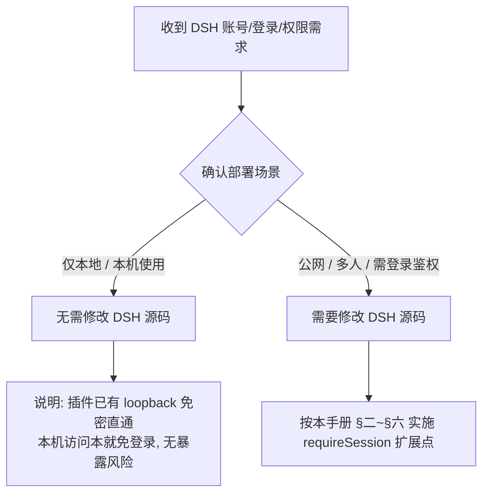

# 给 AI 的决策指导：DSH 公网账号系统（源码级扩展点）

> 本文是给 **AI（代码智能体）** 的决策与修改指导，用于处理用户提出「DSH 账号 / 登录 / 多用户 / 权限」相关需求时，**先正确判断部署场景**，再决定是否需要修改 DSH 源码。
>
> 关联插件：`dsh-postapi-bridge`（登录 / 多账号 / 管理面板）。

---

## 一、AI 决策流程：先判断部署场景（重要）

收到「账号 / 登录 / 多用户 / 权限管理」需求时，**先判断用户的使用场景，不要默认动手改源码**：



### 1.1 仅本地使用（loopback）→ 不改源码
- **结论**：**不需要修改 DSH 源码**。
- **原因**：`dsh-postapi-bridge` 对 loopback 访问本就**免密直通**；本机 `127.0.0.1` 访问无登录门槛，也不存在公网暴露风险。
- **AI 应做**：直接向用户说明「仅本地使用无需账号系统，本机访问即可；若日后需对外多人访问，再启用公网鉴权」，然后停止后续源码改动。

### 1.2 公网 / 多用户使用 → 需改源码
- **结论**：**必须修改 DSH 源码**（仅靠插件不够）。
- **原因**：见 §二。官方 `/api/*` 对公网 `trusted-host` 访问者不做登录校验，未登录即可调用核心功能（含命令执行）。
- **AI 应做**：先向用户确认是否接受「修改官方源码 + fork 维护」的成本（见 §五 git 维护），再按 §三 实施。

> **决策铁律**：用户明确「仅本地」→ **绝不改源码**；用户明确「公网 / 需要登录」→ 才实施扩展点。拿不准时，**先问清部署场景再动手**。

---

## 二、背景：为什么公网必须改 DSH 源码

DSH 官方把 `/api/*` 的信任边界**定义在"谁能连到这个服务"（Host 头），而非"是否登录"**。这是单用户桌面工具的默认设计，且官方 webserver 从架构上**没有给"登录校验"留任何纯插件接入位**：

| 官方架构约束 | 对插件的影响 |
| :--- | :--- |
| **无 HTTP 中间件 / 守卫钩子** | 不存在"在路由前统一鉴权"的扩展点 |
| **路由注册防重复**（同 `kind + path` 抛错） | `/api` 前缀已被 `client-connection` 占用，插件无法覆盖 |
| **前缀匹配需 `startsWith(prefix + "/")`** | 更长的 `/api/` 前缀要求请求以 `/api//` 开头，覆盖不了所有 `/api/*` |
| **RPC interceptor 签名无 request** | `(endpoint, payload, signal)` 拿不到 Cookie / Host 头，无法做鉴权 |

**结论**：要在 `/api` 层强制"必须登录"，唯一可靠且能覆盖含 WebSocket/SSE 全部通道的办法，是在官方核心链路 `packages/client/connection` 开一个**默认关闭的鉴权扩展点**（下述方案 A）。纯插件无法实现。

---

## 三、改动方案：在 `client-connection` 增加 `requireSession` 扩展点

### 3.1 设计原则
- **默认关闭**：新增配置 `requireSession`，默认 `false`。不开启时不改变任何官方单用户行为。
- **实现外置**：源码只留"扩展点"（读取可选的 `sessionAuth` 服务），真正校验逻辑由 `dsh-postapi-bridge` 提供。
- **fail-closed**：`requireSession` 开启但未提供 `sessionAuth` 实现时，公网请求一律拒绝（安全兜底）；本机 loopback 始终放行。
- **覆盖全通道**：同时拦截 `/api` 的 HTTP RPC、事件 SSE、WebSocket 下行。

### 3.2 改动文件
仅一处：`packages/client/connection/src/index.ts`

### 3.3 具体改动（约 25 行）

**① 配置项**（`ConnectionConfig` 接口 + `Config` schema 各加一项）：

```ts
export interface ConnectionConfig {
  trustedHosts?: string[]
  maxRequestBodyBytes?: number
  /** 开启后，非 loopback 请求必须通过 ctx.get('sessionAuth').isAuthenticated(req) 才放行。默认 false。 */
  requireSession?: boolean
}

export const Config: z<ConnectionConfig> = z.object({
  trustedHosts: z.array(String).default([]),
  maxRequestBodyBytes: z.natural().min(1).default(DEFAULT_MAX_REQUEST_BODY_BYTES),
  requireSession: z.boolean().default(false),
})
```

**② 新增鉴权 helper**（放在 `apply` 内）：

```ts
const isAuthenticated = (req: IncomingMessage): boolean => {
  // 未开启 → 恒放行，保持官方行为
  if (!config?.requireSession) return true
  // 本机回环永远放行（supervisor 部署 / 健康检查）
  const host = new URL(`http://${req.headers.host ?? ''}`).hostname
  if (isLoopbackHostname(host)) return true
  // 非回环：必须由已注册的 sessionAuth 服务判定
  const sessionAuth = ctx.get('sessionAuth') as
    | { isAuthenticated: (req: IncomingMessage) => boolean }
    | undefined
  return sessionAuth?.isAuthenticated(req) ?? false
}
```

> `ctx.get('sessionAuth')` 是 Cordis 可选服务。`dsh-postapi-bridge` 通过 `ctx.provide('sessionAuth', { isAuthenticated })` 提供实现（见 §4）。

**③ `/api` HTTP 路由**（原 `route` 定义处，在 Host 围栏之后）：

```ts
const route: WebRoute = {
  kind: 'prefix',
  path: API_PATH,
  handler: async (req, res) => {
    if (!isTrustedApiRequest(req, trustedHosts)) {
      res.writeHead(403); res.end('forbidden'); return
    }
    if (!isAuthenticated(req)) {
      res.writeHead(401); res.end('login required'); return
    }
    await bridge(req, res, fetchHandler, maxRequestBodyBytes)
  },
}
```

**④ WebSocket 下行**（`registerDownlink` 的 handler 内，Host 围栏之后）：

```ts
handler: (req, socket, head) => {
  if (!isTrustedApiRequest(req, trustedHosts)) { rejectWebSocketUpgrade(socket); return }
  if (!isAuthenticated(req)) { rejectWebSocketUpgrade(socket); return }
  return handle(req, socket, head)
}
```

> 需要把 `IncomingMessage` 类型 import 进来（`import type { IncomingMessage } from 'node:http'`）。

### 3.4 验证
```bash
# 开启 requireSession 前：公网未登录可访问 → 200
# 开启后：
curl -s -o /dev/null -w "%{http_code}\n" -X POST http://127.0.0.1:3080/api/session.create \
  -H "Host: dsh.ptrel.cc.cd" -H "Content-Type: application/json" \
  -d '{"rpcId":"t1","method":"session.create","payload":{}}'          # → 401
# 本机 loopback：
curl -s -o /dev/null -w "%{http_code}\n" -X POST http://127.0.0.1:3080/api/session.create \
  -H "Host: 127.0.0.1:3080" -H "Content-Type: application/json" \
  -d '{"rpcId":"t1","method":"session.create","payload":{}}'          # → 200
```

---

## 四、兼容性设计（默认 dsh ↔ 修改后 dsh）

- **不开启 `requireSession`**：修改后的 DSH 行为与官方**完全一致**（单用户、Host 围栏、无登录）。本改动对官方用户零感知。
- **开启 `requireSession`**：需要同时挂载 `dsh-postapi-bridge`（提供 `sessionAuth`），否则公网请求全部 401（fail-closed），仅本机 loopback 可用。
- **判定依据是 Host 头，而非 `x-forwarded-for`**：避免攻击者伪造 `X-Forwarded-For: 127.0.0.1` 绕过鉴权。公网经 nginx/frp 转发后 Host 为 `dsh.ptrel.cc.cd`（非 loopback），走登录校验。

---

## 五、插件侧配合：`dsh-postapi-bridge` 提供 `sessionAuth`

在 `dsh-postapi-bridge/lib/index.js` 的 `apply` 内（已有 `getAuthUser`）增加：

```js
ctx.provide('sessionAuth', {
  isAuthenticated: (req) => {
    if (isLoopbackRequest(req)) return true
    return !!getAuthUser(req)
  },
})
```

`getAuthUser` 校验签名 Cookie（`dsh_postapi_session`）并返回当前用户；未登录返回 `undefined`。这样源码扩展点拿到实现，公网未登录即被拒。

---

## 六、Git 维护指导（本地 + 官方升级）

### 6.1 仓库双 Remote 约定
```bash
origin  git@github.com:deepseek-ai/deepseek-harness.git   # 官方上游（只拉不推）
gitea   ssh://a1@127.0.0.1:2222/ptrel/deepseek-harness.git # 本地备份（可推）
```

### 6.2 本地改动提交
- 本改动只落 `packages/client/connection/src/index.ts` 一处。
- 提交信息建议遵循 Conventional Commits：`feat(connection): add requireSession login guard extension point`。
- **严禁推送到 `origin`（官方仓库）**；只提交到本地并推 `gitea` 备份：
  ```bash
  git add packages/client/connection/src/index.ts
  git commit -m "feat(connection): add requireSession login guard extension point"
  git push gitea master
  ```

### 6.3 后续拉取官方升级（核心注意事项）
由于本地 `master` fork 了官方 `origin/master`，每次上游发布后需手动同步：

```bash
# 1. 拉取官方最新
git fetch origin

# 2. 方式一（推荐）：rebase 本地改动到官方最新基线，历史线性、冲突最易解
git rebase origin/master
# 若冲突：仅 connection/src/index.ts 一处可能冲突，手动解决后：
#   git add packages/client/connection/src/index.ts
#   git rebase --continue

# 方式二：merge 合并
git merge origin/master
```

**冲突处理要点**：
- 上游若改动了 `client-connection` 的 `/api` 路由或 WebSocket downlink，需要把我们的 `isAuthenticated` 判断**重新套到新代码上**（保留扩展点，不丢逻辑）；
- 上游若改动 `ConnectionConfig` / `Config` schema，需要把 `requireSession` 字段**重新追加**；
- 冲突解决后务必：`pnpm install && pnpm run build` + `supervisorctl restart dsh-web`，并重新跑 §2.4 验证（未登录 401 / loopback 200）。

### 6.4 升级后回归清单
1. 默认未开启 `requireSession` 时，官方功能不受影响；
2. 开启后：公网未登录 401、登录后 200、loopback 200；
3. 管理面板（`/admin/server-auth/users`）登录态正常；
4. `dsh-web` 日志无新增 error。

---

## 七、注意事项与风险

1. **改动属"侵入式"**：仅此一处，但已 fork 官方 master。后续每个上游版本都要 review 此文件冲突。
2. **`sessionAuth` 服务名需插件与源码约定一致**：改名的扩展点会让守卫失效（fail-closed 退化为全拒或放行，取决于实现）。建议固定为 `sessionAuth` 并在 README 中声明。
3. **本机 loopback 恒放行**：意味着"能直连 127.0.0.1:3080 的人（本机进程）"可免登录。公网隔离由 frp/nginx 保证，请勿把 3080 直接暴露公网。
4. **WS/SSE 已被拦截**：未登录无法建立事件通道，杜绝实时流信息泄露。
5. **建议在 `skill/memory.md` 记录每次升级的冲突处理结果**，方便追溯。
